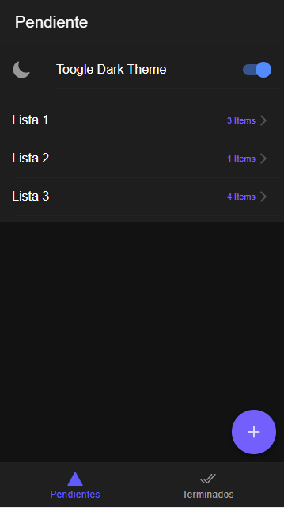
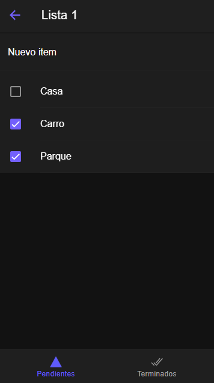
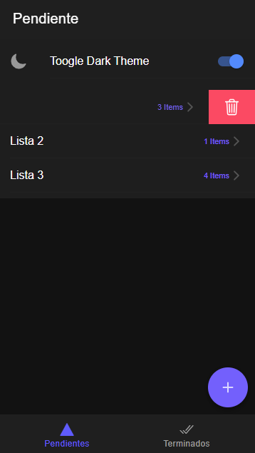
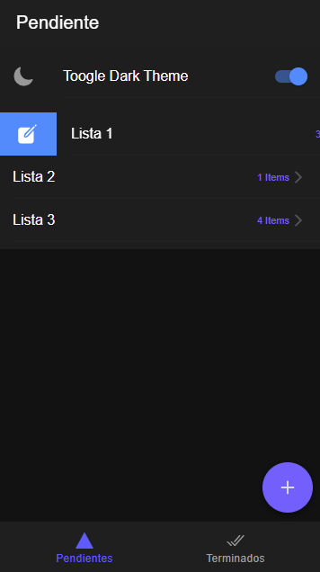
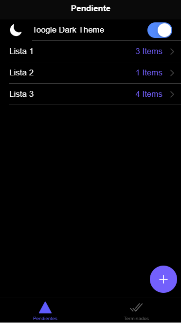
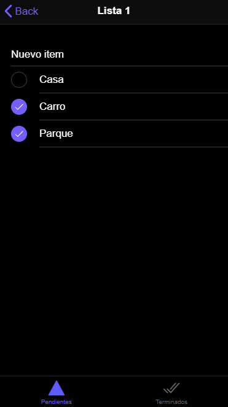
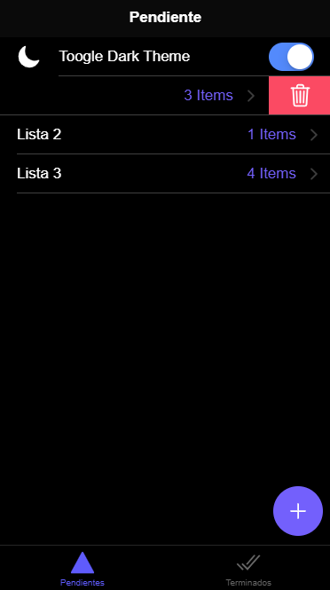
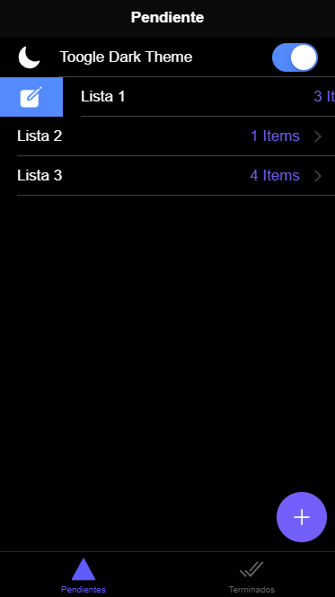

# Ionic List App
Practica de Ionic, creación de listas.

## Screenshots
<div class="row">
    <div class="col">
        
        
        
        
    </div>
    <div class="col">
        
        
        
        
    </div>
</div>


## Herramientas

Para este proyecto se utilizarón las siguientes herramientas

* [Ionic](https://ionicframework.com/)

## Development environment

```bash
git clone https://github.com/{user}/{ruta}
cd ionic-list-app
npm install
ionic serve
```

## Autor


[<br /><sub><b>Fernando Antúnez</b></sub>](https://github.com/FJALCode)<br />[💻](https://github.com/FJALCode "Code") [📢](#talk-Meabed "Talks")

## Expresiones de Gratitud
Proyecto basado en cursos de [Fernando Herrera](https://github.com/Klerith).